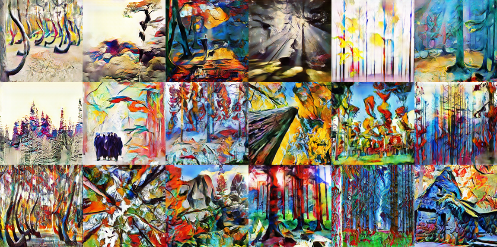

#  인공지능 서비스 / 제품

### 언어

#### Google - Bert(Bidirectional Encoder Representations from Transformers)

- 자연어 처리 태스크를 사전교육 없이 양방향으로 학습하는 시스템입니다. 여기서 '교육 없음' 이란, 별도의 훈련데이터가 아닌 보통의 텍스트 말뭉치를 이용해 훈련되고 있다는 것을 의미합니다. 

#### Cornell Newsroom

- CORNELL NEWSROOM 데이터셋은 문서 요약 시스템의 학습과 평가를 위해 구축되었으며, 약 130만개의 뉴스 기사 및 요약으로 구성되어 있습니다. 
- 38개 매체의 1998년부터 2017년의 뉴스 기사를 활용하였고, 요약문 데이터는 기사 발췌 부분과 학습을 통한 생성 부분을 구분하여 라벨링하고 있습니다. 

#### [Saltlux](http://www.saltlux.com/ai/lea.do?menuNumber=1) - 자연어 이해 엔진 LEA 

- 자연어이해 엔진(LEA - Language Engineering & Analysis)은 비정형 데이터 가공을 위해 형태소 분석, 개체명 인식, 구문 분석, 감성 분석 등의 텍스트 분석 기능을 처리하는 기계학습/심층학습 기반의 언어 분석 엔진입니다. 
- 자연어처리 결과를 바탕으로 문장에 숨겨진 의도를 이해하거나 질문의 유형을 파악하는 등의 한 단계 높은 수준의 분석 결과를 제공함으로써, 대화처리를 위한 의도 이해 및 분석, 심층질의응답을 위한 질문 의미 이해 등이 가능합니다.

### 음성

인공지능 제품이나 서비스를 떠올릴때 우리는 당연히 음성인식을 먼저 떠오를 것이다.  음성으로 알고 싶은 정보나 듣고 싶은 음악을 검색하도록 하거나 가고 싶은 곳을 음성으로 지정해 정보탐색을 하게 합니다. 

#### Amazon - Alexa

- 2014년 스마트 스피커 Echo에 탑재된 음성 인식 AI플랫폼 서비스이다.  사용자의 음성을 클라우드에서 분석해 명령을 수행하는 방식으로 작동한다. 
- 이와 비슷한 서비스로는 구글의 어시스턴트, 애플 시리, 바이두 두어 등이 있다.
- **보이스 커머스**  - 이후 Alexa Skills를 발표해 외부 업체들이 알렉사 스킬을 활용해 음성으로 도미노 피자를 주문하거나, 우버택시를 호출하는 기능을 선보였다. 음성인식 정확도가 높아지면 보이스 커머스의 파급력이 높아지고 있다.

#### Naver - clova 

- 네이버 검색 서비스와 연동해 외국어 번역기 등의 기능을 사용할 수 있다. 음악 스트리밍 서비스와 연동해 음악재생을 지원한다.

#### MUSIAN -  AI 기반 작곡 APP 

- 얼굴을 촬영할 시, 또는 사진을 촬영하면 즉석에서 곡을 작곡해 제공하는 서비스 입니다.
- 저작권의 문제가 없고 사용자가 자신만의 곡을 작곡한다는 것이 장점이라고 할 수 있습니다.. 
- 구글의 마젠타(Magenta), 조지아공대 시몬(Shimon)등이 있습니다.

## 이미지

이미지 분석 기술은 기존에도 컴퓨터 비전(Computer Vision)을 중심으로 연구되어 온 분야입니다. 최근에는 인공신경망 기술인 딥러닝의 등장으로 인해 사람의 시각처럼 높은 정확도와 다양한 사물 인식이 가능한 AI 이미지 분석으로 진화해 가고 있습니다. 

### AI 이미지 분석 적용 분야 

#### 스마트 팩토리 

- LG CNC  AI 제조 연구센터 , Hankook 타이어 디지털 혁신 연구센터 등 연구센터를 운영해 제조공정 과정에 AI기술을 적용하기 위한 연구를 진행하고 있다.

- AI 이미지 분석 기술이 **스마트팩토리**에 적용되면 사람이 일일이 확인하는 것보다 오류 발생 확률을 현저히 낮추고 불량 판정률을 높일 수 있게 됩니다. 
- IOT가 장비의 상태를 24시간 모니터링하고 공간의 물류를 자동으로 반속하고 , AR 장비로 작업자가 장비를 유지보수 한다.

#### [Zinnotech](https://www.zinnotech.com/) - 스마트 유지보수 솔루션 

- 실제 및 가상 세계를 통합해 물리적인 사물과 디지털 객체과 공존하고 실시간으로 상호 작용하는 새로운 환경과 시각을 생성합니다. AR , MR 등 증강, 현실, 가상을 모두 포함하는 기술을 제공합니다. 
- 이를 이용해 제조 공정을 다룰 수 있는 메뉴얼을 제공 훈련하고 배우는 숙련의 과정을 쉽게 적용할 수 있도록 돕는 서비스를 제공합니다.

#### **Amazon Go** - 무인 스토어

- **구매자가 고른 제품을 계산대에 올리면 상품들을 자동으로 인식**하여 계산하는 것이 가능합니다.

- 2016년 미국 시애틀 아마존 본사 건물 1층에 **Amazon Go**라는 상점이 들어 섰다. 고객이 계산대 앞에 줄을 설필요 없이 물건을 집어서 나가면 자동으로 결제되는 시스템을 구축한 것입니다. 
- 이는 컴퓨터 비전과 센서융합 그리고 딥러닝 알고리즘 기술이 적용되었다. 
- 고객이 매장에 들어서는 순간 해당 고객의 동선을 촬영하고 전용 앱을 통해 고객 정보를 확인 후 해당 고객의 동선을 파악한다. 상품에 탑재된 센서와 고객 스마트 폰은 연동되어 자동 결제와 전자영수증 발급됩니다.

#### GAN **(Generative Adversarial Network)**

- **이미지 자체를 생성하는 AI 기술**도 큰 발전을 이루고 있습니다.  유사하지만 실제로 존재하지 않는 이미지를 생성합니다. 분석에 필요한 데이터를 생성할 수도 있고, 미술 · 디자인과 같은 창작 활동 등에서도 활용할 수 있습니다.

#### [Computer Generated Art](https://towardsdatascience.com/cyclegans-to-create-computer-generated-art-161082601709)

#### 

#### [GAN을 이용한 여러 응용프로그램](https://machinelearningmastery.com/impressive-applications-of-generative-adversarial-networks/)

- 이미지 데이터 세트에 대한 예제 생성
- 사람 얼굴 사진 생성, 만화 캐릭터 생성 
- 이미지와 이미지 그리고 이미지와 텍스트 간 번역 등등 

## 자율주행 

> 자율주행차는 운전자 또는 승객의 조작없이 자동차 스스로 운행이 가능한 자동차로서, 자동차 스스로 사람의 인지, 판단, 제어 기능을 대체해 운전

**출처** : [KDB산업은행 미래연구소 : 자율주행차 국내외 개발 현황](https://rd.kdb.co.kr/fileView?groupId=9079A41A-33FF-94DC-7492-B1028A5CB1DD&fileId=75221FDC-1CFD-71FD-667D-C9AEEA562DAD)

### 자율주행 단계 

자율 주행차는 운전자의 개입여부, 자동화 수준에 따라 6단계로 구분되며,  Level3 단계 이상은 일부 또는 완전 자율 주행 기능이 실행되고 있습니다. 

| 단계 | Level 0           | Level 1                          | Level 2                          | Level 3                       | Level 4                    | Level 5                     |
| ---- | ----------------- | -------------------------------- | -------------------------------- | ----------------------------- | -------------------------- | --------------------------- |
| 특성 | 자율주행기능 없음 | 가‧감속 등 자동화 기능 운전 보조 | 2가지 이상 자동화 기능 동시 작동 | 특정상황에서 운전자 개입 필요 | 특정지역에서 자율주행 가능 | 모든지역, 모든상황 자율주행 |
| 예시 | 사각지대 경고     | 차선유지 또는 크루즈 기능        | 차선유지 및 크루즈 기능          | 혼잡구간 주행지원 시스템      | 지역(Local) 무인택시       | 운전자 없는 완전자율주행    |

###### 자료 : 미국자동차기술학회(Society of Automotive Engineers, SAE)

- 자율주행 기술은 주행에 필요한 정보‧신호를 입력받는 인지기술, 정보‧신호를 처리하는 소프트웨어 등 판단기술, 조향‧제동‧가속 등 제어기술 등으로 구성되어 있습니다. 

#### 인지기술 

- 차량의 주변 상황 인식을 위해 필요한 센서(레이더, 라이더, 카메라, 나이트비전 등)의 설계 및 제작과 신호처리 알고리즘 구축
- 고정밀 GPS 기술, 실시간 지역 정밀지도 구축 및 이를 위한 데이터베이스 등 인프라설비 구축 등도 위치 정밀측정

|      센서       |                           칩                           | 모듈                                                         | 시스템                                                       |
| :-------------: | :----------------------------------------------------: | ------------------------------------------------------------ | ------------------------------------------------------------ |
| 라이다 (Lidar)  |  레이저 신호처리 칩  (Osram Opto Semiconductors)  | 2D Scan(Continental) 3D Scan(Velodyne, IBEO)                 | 2D Scan(Continental) 3D Scan(Denso, Valeo)                   |
| 레이더 (Radar)  | 레이더 신호처리 칩  (Infineon, Texas Instruments) | 운영 소프트웨어 및 시스템 (Continental, Bosch, Denso, Autoliv) | 운영 소프트웨어 및 시스템 (Continental, Bosch, Denso, Autoliv) |
| 카메라 (Camera) |     이미지 신호처리 칩  (Aptina, OmniVision)      | 영상처리 모듈 (Intel Mobileye)                               | 영상인식 시스템 Continental, Bosch, Denso)                   |

###### 자료 : KDB산업은행 미래연구소 - 자율주행차 국내외 개발 현황

#### 판단기술 

- 인공지능, 차량용 소프트웨어 관련 기술로써, 인지‧판단‧제어 등 모든 자율주행 단계에 관여하는 자율주행의 핵심기술 
- 기존에는 고가의 특화된 센서들을 사용하여 규칙기반 방식(Rule-Based) 소프트 웨어 알고리즘을 사용하였으나 이미지 인식 분야 등에서는 범용적인 센서에 인공지능(AI)기술을 적용한 방식이 자리를 잡음
- 이외에도 경로 최적화, 상황판단, 충돌예측, 돌발상황 대응 등에도 인공지능 기술이 활용 
- 현재 자율주행에 필요한 인지, 판단, 제어 등 단계를 기능별로 구분하여 소프트웨어를 운용하고 있으나 전체 과정을 인공지능으로 한번에 구현하는 엔드투엔드(End to End) 방식도 연구개발 중

#### 제어기술 

- 판단에 따라 차량에 장착된 각종 제동, 조향, 가속 등 차량의 엑츄 에이터(Actuator, 구동장치)를 적절하게 제어하는 기술 
- 기존 내연기관 차량의 자율주행도 가능하지만 전기차 등 모터 기반의 전자식 엑츄에이터가 정밀제어에 보다 유리

#### 네트워크

- 차량내 외부의 각종 센서 및 교통 인프라와 차량간, 차량-사람, 차량-인프라 통신을 가능하게 하는 V2X(Vehicle to Everything) 통신 기술 
- 차량의 센서에만 의지(Stand-alone Type) 7)하지 않고 V2X 등 협력통신기술을 활용하여 교통인프라, 관제센터와 연결되어 교통환경 정보를 파악(Connected Type)하므로 주행 안전성이 높아짐

- 자율주행 단계가 높아질수록 도로인프라(신호등, 가드레일, 가로등, 버스정류소 등) 와 차량 간 통신을 지원하는 표준, 이들 간의 연동과 통합 정보 제어를 위한 시스템 구축 등 스마트 시티와 같은 도시 인프라가 병행되어야 함

#### 레벨 4  자율 주행  AI

- SAE(Society of Automotive Engineers) 의하면, 레벨 4 이상 자율주행은 주행환경에 대한 모니터링과 시스템 오류에 대한 폴백(Fallback) 기능까지 모두 운전자의 개입 없이 시스템이 자체적으로 대응할 수 있는 수준이라고 정의내리고 있습니다.
- 이러한 자율 주행기술의 확보를 위해서는 공간 정보를 사용해 도로 위 차량 및 물체, 교통 사항 등을 사람대신 식별 및 판단하고 핸들과 브레이크를 제어할 AI 의 역할이 무척 중요합니다. 
-  AI 기술은 주로 인지 분야에서 활용되고 있고, 이중에서도 영상센서를 이용한 객체탐색용 딥러닝 모델 연구가 활발하게 진행되고 있습니다. 

### AI 적용한 자율 주행 서비스

**출처** : [AI REVOLUTION IN THE AUTO INDUSTRY]( https://builtin.com/artificial-intelligence/artificial-intelligence-automotive-industry)

#### [NUTONOMY](https://www.aptiv.com/solutions/autonomous-mobility) - 교통 상황 탐색

- 복잡한 교통 상황을 탐색하는 nuCore 소프트웨어를 개발
- 유연하고 인간적인 차량운행이 가능한 완전 무인자율주행 차량을 위한 기술개발을 진행 
- 이 회사의 목표는 안전한 도로, 교통량 및 오염을 최소화하는 데 필요한 모든 곳에 자율 주행 차량을 제공하는 것입니다.

#### [AUTOX](http://home.autox.ai/ko/index.html) :자가 운전 식료품 배달

- 아시아 최초로 하드웨어 기술을 선보인 로보택시 출시
- 이 회사의 차량은 AI 소프트웨어, 센서, 실시간 카메라 및 가상 및 실제의 수천 마일의 테스트 마일을 결합하여 도로에서 안전한 결정을 내릴 수 있습니다.

- 현재 식료품 배달에 중점을 둔 앱을 통해 사용자는 상품을 선택하고 배송시 차량 기반 모바일 상점을 찾아 볼 수있는 기능을 제공하고 있습니다.
- 서비스 지역 확장을 목표로 하고 있습니다.

#### [Optimus Ride](https://www.optimusride.com/) : 지속 가능한 운송

- 효율적이고 지속 가능한 도시를 구현해 주차 공간을 늘리고 도로의 차량 수를 제한해 환경을 미치는 영향을 줄이고자 합니다. 

- 메사추세스 도시 내에서 차량테스트를 진행중에 있고,  지역 커뮤니티 및 도시와 마을을 위한 자율주행 운송 서비스 제공을 목표로 하고 있습니다. 

#### [CarVi](https://getcarvi.com/) : 운전 습관 교정

- CarVi는 AI를 사용하여 차선 이탈, 전방 충돌 및 운전 조건과 같은 가능한 위험을 운전자에게 경고하기 위해 주행 분석 및 실시간 경고를 제공합니다.
- 점수 시스템을 사용하여 운전 기술을 평가하고 운전자가 나쁜 행동과 습관을 바꾸도록 도와줍니다.
- 자율주행 차량 뿐만 아니라 기존 차량에서도 설치가 되며 차량 회사가 차량을 추적하고 차량 성능에 대한 보고서를 받고 이벤트가 일어난 캠 장면을 제공해 전반적으로 더 안전한 운전자에게는 보험료를 줄여주는 서비스를 제공할 수 있습니다.

